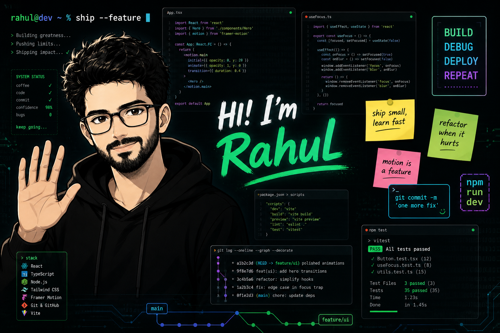

<!-- Banner Image -->

<em><strong>I'm a Software Engineer with 8+ years of experience building scalable web products. I specialize in React, TypeScript, and interfaces that feel fast, precise, and cinematic — from enterprise data grids to motion-led product surfaces.</strong></em>
  

  
  
  

  
  
  
  
  

---

### About Me

* Currently working as **Software Engineer @ EPAM Systems** in Bengaluru
* Specializing in **React, TypeScript, Next.js**, and production-grade frontend architecture
* Exploring **AI agents, multi-agent orchestration**, and intelligent developer workflows
* Previously spent 4 years at **Syncfusion** building enterprise UI components and data grids
* Email: [rahulkishore227@gmail.com](mailto:rahulkishore227@gmail.com)

---

### Skills and Tools

#### Frontend

#### Backend & Data

#### Languages & Platforms

#### Tools

---

### Featured Projects

<table>
  <tr>
    <td width="50%">
      <h4>APOGEE</h4>
      
A cinematic GSAP scroll landing page built for the CodeTV × Webflow Cloud hackathon — atmosphere, pacing, and type as the product.

      

        
        
        
      

      
    </td>
    <td width="50%">
      <h4>Vault</h4>
      
A full-stack expense tracker with auth, transactions, analytics, and budgets — built with Next.js, Clerk, Prisma, and Supabase.

      

        
        
        
      

      
    </td>
  </tr>
  <tr>
    <td width="50%">
      <h4>Terminal Portfolio</h4>
      
An interactive terminal-style portfolio where visitors explore work through commands, prompts, and a retro CLI experience.

      

        
        
        
      

      
    </td>
    <td width="50%">
      <h4>Let's Collaborate</h4>
      
I'm always open to collaborating on React products, motion-led interfaces, AI-powered developer tools, or frontend architecture work.

      

        
        
      

      
    </td>
  </tr>
</table>

---

### Contribution Snake

  

---

  

    
    
  

  
<em>If you like my work, drop a star!</em>

  
Made by <strong>Rahul Narayanasamy</strong> &nbsp;|&nbsp; Bengaluru, India

